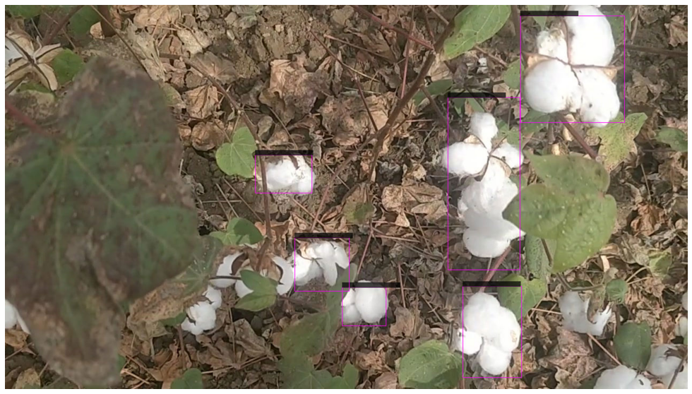

# Cotton-Harvesting-Robot-using-YOLOv3-and-Darknet-
Cotton Detection

#Introduction/problem statement:
The number of people engaged in agriculture is decreasing, and the country's population is rapidly increasing. Agricultural automation is one of the solution to these problems. "Harvesting robots" driven by AI and robotic technology are gathering attention day by day. The idea is to leave harvesting work, which accounts for 20% or even more of all agricultural work, to robots in order to increase efficiency. we are focusing on mainly building harvesting robot for cotton, for that we need a robot which can detect cotton
so we are building a deep learning model which can detect cotton using Yolov3/Yolov4 using Darknet

Google Colab Notebook :
We need good GPU inorder to Train the model and Google calab seemed to be best chioce.Colab is a Python development environment that runs in the browser using Google Cloud .You need to enable GPU acceleration within your Colab notebook so that your YOLOv3 system will be able to process detections over 100 faster than CPU.

The steps needed are:
1.Gathering data                                                                                                                                                                 
2.Converting to YoloV3 format                                                                                                                                                   
3.Setting Training Pipeline                                                                                                                                                     
4.Training model                                                                                                                                                                 
5.Exporting weights file.                                                                                                                                                       
6.Testing model                                                                                                                                                                 

#1.Gathering Data:                                                                                                                                                              
collecting data is the most crutial part of any custom object detection model. As we didn't have any data available on internet. we collected data from cotton field directly
by taking videos and extracted images from them.Later separating good images we got our dataset for project.

#2.Converting to YoloV3 format:                                                                                                                                                 
YOLO was trained to accept data in a specific format. Every Image should contain a txt file exactly with the same name as the image. IMAGEAME.JPG , IMAGENAME.TXT
Each text file should contain the objects in a New line. And each line should be ,

Class(int), X(float between zero and one ) , Y( float between zero and one) , Width( float between zero and one) , Height ( Float between zero and one)

To obtain float X and Width should be divided by width of the image whereas. Y and height should be divided by height of the image . Width and height of the image are not the same as width and height of detection.
we use *labelimg* tool for labelling cotton in the image dataset and save it in Yolo format. Label all the images and save it in a folder.

#3. Configuring Files for Training and testing:                                                                                                                                 
Mount the google drive on colab notebook then upload the labelled data in the form of Zip file and unzip the file in google drive. 
we need following files to train the data:                                                                                                                                      
*   Labeled Custom Dataset
*   Custom .cfg file
*   obj.data and obj.names files
*   train.txt file (test.txt is optional here as well)
##i) Cfg File                                                                                                                                                                   
1. Set max_batches=6000 ,classes=1(cotton is the only object that we want to detect),filters=18(for 1 class)
2. obj.names and labelled_data.data                                                                                                                                          
Create a new file within a code or text editor called **classes.names** and you will make this file exactly the same as your classes.txt in the dataset generation step.
and create a labelled_data.data that contains informations about all the folders and files required for training
3. Generating train.txt and test.txt files which have names of all the train and test images 
Now we are ready to train the data

4.Training model:                                                                                                                                                               
Train the data using the following command                                                                                                                                      
download pretrained weights from ImageNet and use to it for training
#### ./darknet detector train -- weights(your weights file) -- cfg(your cfg file) -- obj.data 

#5.Exporting weights file.                                                                                                                                                  
Yolo saves weights of the trained model for every 1000 iterations in backup folder.
download the best weights from the backup folder and test the weights on test data

6.test the model:                                                                                                                                                       
test the model against new images/test images and see how model is performing
use following command to test the data:                                                                                                                                   

#TESTING AND RESULTS :
I trained the model using only 110 images for 6000 iterations and Calculated the mean average precision(mAP) using darknet map command and found it to be 73.40 at the IoU threshold of 0.5 . I assumed that it would suffice. Backed the weights up to my google drive folder after every 1000 iterations.
Average Intersection over union is 74.5 percent. More data would have helped this

:Detected image:                                                                                                                                                                 

#OBSERVATIONS:                                                                                                                                                                  
Using more data for training would have been useful for getting better mAP 
Data Augmentation would have been very useful
More Iterations would be better for getting more accuracy

